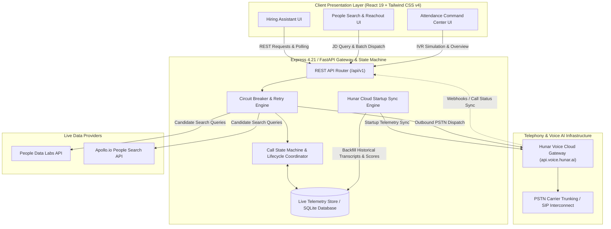
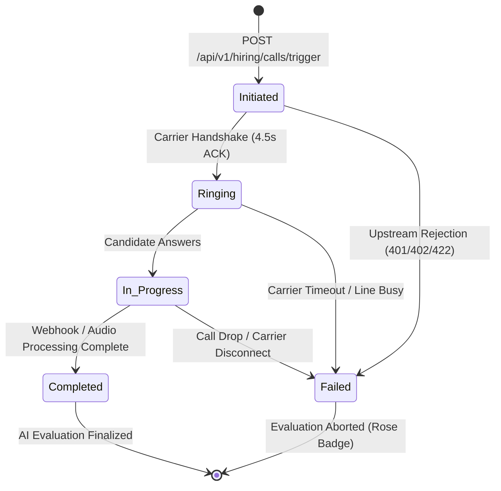

# 🎙️ Enterprise Voice AI Platform

[](https://www.typescriptlang.org/)
[](https://nodejs.org/)
[](https://www.python.org/)
[](https://fastapi.tiangolo.com/)
[](https://react.dev/)
[](https://tailwindcss.com/)
[](https://expressjs.com/)
[](https://render.com/)
[]()

A carrier-grade, multimodal enterprise voice automation suite. The platform unifies **autonomous outbound technical screening**, **dynamic job description parsing & talent search**, and **smartphone-free workforce attendance verification** with acoustic voiceprint biometrics—backed by resilient circuit-breaker architecture, cloud startup synchronization, and zero-exposure security protocols.

---

##  Table of Contents

- [Executive Summary](#-executive-summary)
- [System Architecture & Design](#️-system-architecture--design)
- [Core Platform Modules](#-core-platform-modules)
  - [Module 1: Autonomous AI Hiring Assistant](#module-1-autonomous-ai-hiring-assistant)
  - [Module 2: People Search & Autonomous Reachout](#module-2-people-search--autonomous-reachout)
  - [Module 3: Smartphone-Free Attendance System](#module-3-smartphone-free-attendance-system)
- [Resilience & Circuit-Breaker Architecture](#-resilience--circuit-breaker-architecture)
- [API Reference Specifications](#-api-reference-specifications)
- [Dual-Runtime Support (Node.js & Python FastAPI)](#-dual-runtime-support)
- [Environment Configuration](#-environment-configuration)
- [Installation & Getting Started](#-installation--getting-started)
- [Production Deployment on Render](#-production-deployment-on-render)

---

##  Executive Summary

Enterprise voice operations require strict reliability, zero-leak telemetry, and deterministic evaluation guarantees. This platform provides an end-to-end solution for high-volume enterprise telephony workloads across three mission-critical verticals:

1. **AI Hiring Assistant:** Autonomous conversational screening calls powered by the Hunar Voice API, providing real-time transcripts, structured multi-dimensional candidate evaluations, carrier disconnect recovery, and cloud synchronization across server restarts.
2. **People Search & Reachout:** Zero-regex Natural Language Job Description parser with deterministic experience tier filtering, live integration with People Data Labs (PDL) and Apollo.io, global multi-region candidate pools, and 1-click batch voice campaign dispatch.
3. **Smartphone-Free Attendance System:** Inbound toll-free IVR check-in designed for globally distributed field, mining, construction, and offline personnel. Verifies dual DTMF station codes, extracts verbal shift confirmations, and enforces acoustic voice biometric validation across 10 strategic international hubs (India, APAC, Europe, MENA).

---

##  System Architecture & Design



### Telephony State Machine & Evaluation Flow



---

##  Core Platform Modules

### Module 1: Autonomous AI Hiring Assistant
- **Carrier Dispatch & Tracking:** Dispatches autonomous outbound screening calls via the Hunar Voice API with dynamic candidate prompts and custom persona parameters.
- **Hunar Cloud Startup Synchronization:** Automatically queries Hunar Cloud on application startup (`syncHunarCallsOnStartup` / `sync_hunar_calls_to_db`) to hydrate past screening calls, transcripts, scores, and audio recordings, preventing data loss across container redeployments.
- **Multi-Webhook Ingestion Pipeline:** Ingests granular multi-stage webhooks (`call_status_callback_url`, `call_recording_callback_url`, `call_result_callback_url`, `call_summary_callback_url`), extracting dialogue turns, candidate sentiment, rich summary notes, and multi-dimensional scoring (0–100 scale).
- **Bi-Directional Telephony Sync:** Dual-channel polling (`GET/POST /api/v1/hiring/calls/:callId/refresh`) and incoming webhook ingestion (`POST /api/v1/webhooks/hunar`).
- **Synchronized State Machine:** Guarantees upstream rejections immediately mark calls as `Failed` with `Evaluation Aborted` indicators, eliminating UI/state desync.
- **True Telemetry Store:** Real-time KPI dashboard computing average call duration, exact candidate interest dispositions, and live conversion rates without artificial statistical inflation.

### Module 2: People Search & Autonomous Reachout
- **Zero-Regex Dynamic Experience Extractor:** Parses complex natural language phrasing (`"8/10 YOE"`, `"decade of experience"`, `"minimum 6 yrs"`, `"principal tier"`) into deterministic numeric bounds (`min_years_required`, `max_years_required`, `experience_tier`).
- **Global Multi-Region Candidate Pool:** Features international tech talent profiles across India, Singapore, UK, Germany, Switzerland, Japan, and the Netherlands with authentic E.164 dialing codes (`+91`, `+65`, `+44`, `+49`, `+41`, `+81`, `+31`).
- **Multi-Provider Live Integration:** Searches live profiles across **People Data Labs (PDL)** and **Apollo.io** when API keys are configured, gracefully degrading to a curated talent pool with explicit `data_source` indicators.
- **Deterministic Qualification Boundary:** Enforces a hard experience gate before ranking candidate skill intersections against job requirements.
- **1-Click Batch Campaign Dispatcher:** Queues concurrent outbound screening calls across selected candidates under unique campaign IDs.

### Module 3: Smartphone-Free Attendance System
- **1-800 Toll-Free Inbound IVR Pipeline:** Enables field operators without smartphones to clock in from standard landlines or basic mobile phones.
- **10 Strategic Global Hubs:** Live command stations distributed across India (Bengaluru `BLR-01`, Hyderabad `HYD-02`), APAC (Singapore `SIN-01`, Tokyo `TYO-01`, Taipei `TPE-01`), Europe (Munich `MUC-01`, London `LON-01`, Rotterdam `RTM-01`, Stockholm `ARN-01`, Zurich `ZRH-01`), and MENA (Dubai `DXB-01`).
- **Acoustic Voiceprint Biometrics:** Correlates 4-digit employee IDs with acoustic signatures, flagging mismatches (`voiceprint_match: false`) for supervisor review.
- **Multi-Factor Verification:** Validates DTMF dual-tone keypad inputs against verbal station confirmations to catch geo-location and shift discrepancies.
- **Live Roster Telemetry:** Tracks distributed field stations with real-time attendance rates, late alerts, and critical anomaly statuses.

---

##  Resilience & Circuit-Breaker Architecture

| Layer | Resiliency Mechanism | Technical Implementation |
|---|---|---|
| **Outbound Telephony** | Exponential Backoff with Timeout | `fetchWithRetry` with `AbortController`, 5–10s timeout, and exponential backoff retry. |
| **Startup State Recovery** | Cloud Telemetry Startup Sync | Automatic Hunar cloud query on boot backfills historical transcripts, summaries, and scores without wiping records. |
| **Upstream Rejection** | Fast-Fail Circuit Breaker | Non-2xx responses from telephony providers immediately transition state to `Failed`, halting auto-advance timers. |
| **Frontend Network** | Auto-Recovery Retry Client | `fetchWithAutoRecovery` retries transient 502/503/504 errors up to 5 times over 15 seconds. |
| **Search Fallback** | Tiered Provider Degradation | `PDL API` → `Apollo.io API` → `Local Verified Global Talent Pool` with honest `api_status` labels. |
| **Production Serving** | Static Decoupled Serving | `express.static('dist')` + SPA catch-all route, activated by `NODE_ENV=production`. Zero Vite HMR or WebSocket listeners in production. |

---

## 📡 API Reference Specifications

### 1. System Health
#### `GET /api/health`
Returns system status, active telephony configuration, and timestamp.
```json
{
  "status": "healthy",
  "hunar_configured": true,
  "timestamp": "2026-09-07T14:00:00.000Z"
}
```

---

### 2. Module 1: AI Hiring Assistant

#### `POST /api/v1/hiring/calls/trigger`
Dispatches an outbound screening call to a candidate.
- **Headers:** `Content-Type: application/json`
- **Request Body:**
  ```json
  {
    "candidate_name": "Vinay K S",
    "phone_number": "+916361006588",
    "position": "Forward Deployed AI Engineer",
    "custom_prompt": "Screen candidate for distributed systems and Kafka architecture."
  }
  ```
- **Response (201 Created):**
  ```json
  {
    "id": 11,
    "call_id": "hunar_call_mtpj66lr_yszi",
    "candidate_name": "Vinay K S",
    "phone_number": "+916361006588",
    "position": "Forward Deployed AI Engineer",
    "status": "Initiated",
    "duration_seconds": 0,
    "transcript": "Voice screening call dispatched to +916361006588...",
    "overall_score": 0,
    "interest_score": 0,
    "answers_summary": "Call initiated. Live audio stream processing.",
    "disposition": "Pending",
    "created_at": "2026-09-07T14:00:00.000Z"
  }
  ```

#### `GET /api/v1/hiring/calls`
Retrieves all screening call records. Supports query filtering by status (`?status=Completed`).

#### `GET /api/v1/hiring/calls/:callId`
Retrieves single call record by its unique `call_id`.

#### `GET /api/v1/hiring/calls/:callId/refresh` (or `POST`)
Polls Hunar Voice Cloud for live carrier status, updating transcript, duration, score, and audio recording URLs in the live database.

#### `POST /api/v1/hiring/calls/:callId/simulate-failure`
Simulates a carrier disconnect, busy tone (SIP 486), or unreachable terminal.

#### `POST /api/v1/webhooks/hunar`
Receives asynchronous post-call completion webhooks from the Hunar Voice Cloud Gateway.

---

### 3. Module 2: People Search & Reachout

#### `POST /api/v1/search-candidates`
Parses unstructured job descriptions and returns filtered, ranked candidate profiles.
- **Request Body:**
  ```json
  {
    "job_description": "Looking for a Staff Distributed Systems Engineer with 8+ years of experience in Python, FastAPI, and Kafka."
  }
  ```
- **Response (200 OK):**
  ```json
  {
    "metadata": {
      "domain": "Enterprise Software Engineering",
      "experience_level": "Staff / Principal (8-12+ yrs)",
      "experience_tier": "Principal/Staff",
      "extracted_skills": ["Python", "FastAPI", "Kafka"],
      "suggested_locations": ["Bengaluru, India", "Singapore", "Munich, Germany", "Remote"],
      "provider": "Verified Global Talent Pool",
      "api_status": "Active",
      "min_years_required": 8,
      "max_years_required": null
    },
    "candidates": [
      {
        "candidate_id": "cand_02",
        "name": "Marcus Aurelius Vance",
        "title": "Staff Distributed Systems Architect",
        "location": "Munich, Germany",
        "contact_phone": "+49-89-555-0198",
        "skills": ["Python", "FastAPI", "Kafka", "Kubernetes"],
        "matching_skills": ["Python", "FastAPI", "Kafka"],
        "experience_years": 10,
        "match_percentage": 100,
        "outreach_status": "Ready for Reachout"
      }
    ],
    "total_matched": 1,
    "data_source": "mock_fallback"
  }
  ```

#### `POST /api/v1/trigger-bulk-reachout`
Dispatches concurrent voice screening campaigns to multiple candidates.

#### `GET /api/v1/reachout/telemetry`
Returns aggregate campaign KPIs derived purely from live call records.

---

### 4. Module 3: Smartphone-Free Attendance System

#### `GET /api/v1/attendance/overview`
Returns live overview statistics across all global field sites and recent check-in records.

#### `POST /api/v1/attendance/simulate-ivr`
Processes an inbound IVR attendance check-in session.
- **Request Body:**
  ```json
  {
    "employee_id": "1042",
    "site_code": "BLR-01",
    "spoken_location": "Field Station BLR-01",
    "spoken_shift_time": "07:00 AM",
    "audio_site_code": "BLR-01"
  }
  ```
- **Response (201 Created):**
  ```json
  {
    "id": 1,
    "employee_id": "1042",
    "employee_name": "Worker #1042",
    "site_code": "BLR-01",
    "site_name": "Bengaluru Logistics Terminal (BLR-01)",
    "checkin_time": "2026-09-07T14:00:00.000Z",
    "status": "On-Time",
    "audio_site_code_verified": true,
    "voiceprint_match": true,
    "voice_transcript": "IVR Inbound Gateway [Toll-Free 1-800-VOICE-HR]...",
    "anomaly_reason": null,
    "call_duration_seconds": 45
  }
  ```

---

##  Dual-Runtime Support

This platform supports two production-ready backend implementations:

| Feature | Primary Service (`server.ts`) | Python Backend (`backend/`) |
|---|---|---|
| **Runtime** | Node.js 22 + Express + TypeScript (`tsx`) | Python 3.11+ + FastAPI + `uvicorn` |
| **Entry Point** | `server.ts` (Repository Root) | `backend/app/main.py` |
| **Frontend Serving** | ✅ Serves compiled Vite React SPA directly | ❌ API-only service (pair with frontend) |
| **Hunar Cloud Sync** | ✅ Built-in (`syncHunarCallsOnStartup`) | ✅ Built-in (`sync_hunar_calls_to_db`) |
| **Render Deploy** | ✅ Default fullstack deployment | Optional secondary worker |
| **Interactive Docs** | REST API specifications | Swagger UI at `http://localhost:8000/docs` |

---

## ⚙️ Environment Configuration

Copy `.env.example` to `.env` and fill in your values:

```bash
cp .env.example .env
```

| Variable | Required | Default | Description |
|---|---|---|---|
| `PORT` | Optional | `3000` | HTTP port for server binding (auto-injected by Render) |
| `NODE_ENV` | **Required (prod)** | `development` | Set to `production` to activate static serving mode |
| `HUNAR_API_KEY` | Recommended | — | API Token from [Hunar Voice](https://app.voice.hunar.ai) |
| `HUNAR_BASE_URL` | Optional | `https://api.voice.hunar.ai` | Hunar Voice Gateway endpoint |
| `HUNAR_SCREENING_AGENT_ID` | Optional | `0f870d5a-ba01-4a4a-bc97-611727aa1837` | Agent ID for candidate technical screening |
| `HUNAR_REACHOUT_AGENT_ID` | Optional | `ffc1ebd5-6c44-4864-be80-cbf5e0ae8011` | Agent ID for batch talent reachout |
| `HUNAR_IVR_AGENT_ID` | Optional | `845421cc-5b74-43bc-a9ae-2aaf78b4e403` | Agent ID for IVR attendance verification |
| `APP_PUBLIC_URL` | **Required (prod)** | — | Your deployed URL (e.g. `https://your-app.onrender.com`) — used to register Hunar webhook callbacks |
| `PDL_API_KEY` | Optional | — | [People Data Labs](https://www.peopledatalabs.com/) API Key |
| `APOLLO_API_KEY` | Optional | — | [Apollo.io](https://apollo.io/) People Search API Key |
| `DATABASE_URL` | Optional | `sqlite:///./app.db` | Database connection string for Python backend |

---

## 🚀 Installation & Getting Started

### Prerequisites
- **Node.js**: `v20.x` or `v22.x` (LTS recommended)
- **Python**: `v3.11+` (optional for Python backend)
- **npm**: `v10.x` or later

### 1. Clone & Install Dependencies
```bash
git clone https://github.com/Vinay-014/enterprise-voice-ai.git
cd enterprise-voice-ai
npm install
```

### 2. Configure Environment
```bash
cp .env.example .env
# Edit .env and fill in your HUNAR_API_KEY and agent IDs
```

### 3. Run in Development Mode
Runs the TypeScript server with `tsx watch` for automatic live-reloading:
```bash
npm run dev
```
Open [http://localhost:3000](http://localhost:3000) in your browser.

### 4. (Optional) Run the Python Backend
```bash
cd backend
python -m venv .venv
source .venv/bin/activate    # On Windows: .venv\Scripts\activate
pip install -r requirements.txt
uvicorn app.main:app --reload --port 8000
```
Access interactive API docs at [http://localhost:8000/docs](http://localhost:8000/docs).

### 5. Build the Frontend
```bash
npm run build
# Outputs: dist/index.html + dist/assets/
```

### 6. Run Static Type Checking
```bash
npm run lint
```

---

## 🌐 Production Deployment on Render

This platform is deployed as a **single unified Node.js/Express service** on [Render](https://render.com/), serving both the Vite frontend and all API routes from one process.

### How It Works

```
Render Build Step:   npm install && npm run build
                     └─ vite build → dist/ (static frontend assets)

Render Start Step:   npm start
                     └─ NODE_ENV=production tsx server.ts
                        ├─ Detects NODE_ENV=production
                        ├─ Runs Hunar Cloud Startup Sync (hydrates real calls)
                        ├─ Serves dist/ via express.static()
                        ├─ SPA catch-all: GET * → dist/index.html
                        └─ All /api/v1/* routes active
```

### Deploy to Render

1. **Create a new Web Service** on [render.com](https://render.com/) → connect your GitHub repo.
2. **Set Build & Start commands:**
   | Field | Value |
   |---|---|
   | Build Command | `npm install && npm run build` |
   | Start Command | `npm start` |
3. **Add Environment Variables** in the Render dashboard:
   ```
   NODE_ENV=production
   HUNAR_API_KEY=<your-live-api-key>
   HUNAR_BASE_URL=https://api.voice.hunar.ai
   HUNAR_SCREENING_AGENT_ID=0f870d5a-ba01-4a4a-bc97-611727aa1837
   HUNAR_REACHOUT_AGENT_ID=ffc1ebd5-6c44-4864-be80-cbf5e0ae8011
   HUNAR_IVR_AGENT_ID=845421cc-5b74-43bc-a9ae-2aaf78b4e403
   APP_PUBLIC_URL=https://<your-app>.onrender.com
   ```
4. **Deploy** — Render will run the build command, then start the server.
5. **Post-deploy verification:**
   ```
   GET https://<your-app>.onrender.com/api/health   → { "status": "healthy" }
   GET https://<your-app>.onrender.com/              → React SPA loads
   GET https://<your-app>.onrender.com/hiring        → Client-side route works (no 404)
   ```

> **Webhook Registration:** Once deployed, update `APP_PUBLIC_URL` in Render's environment to your live Render URL. This ensures Hunar Voice API posts call status webhooks to `https://<your-app>.onrender.com/api/v1/webhooks/hunar`.

### Security & Hardening Checklist
- [x] **Zero-Exposure Secrets:** All API keys accessed server-side via `process.env` only — never bundled into client code.
- [x] **Git Tracking Safeguards:** `.env` excluded from version control via `.gitignore`.
- [x] **Cloud Telemetry Startup Sync:** Automatic state hydration from Hunar API preventing call loss across deployments.
- [x] **HMAC-SHA256 Webhook Verification:** Canonical signature check with 300-second replay protection on all incoming Hunar webhooks.
- [x] **Strict Type Safety:** Validated against TypeScript 5.8 with strict null checks and `noImplicitAny`.
- [x] **ESM-Clean Production Detection:** `isProduction` uses `NODE_ENV === 'production'` exclusively — no fragile `__filename` checks.
- [x] **Clean Port Deconfliction:** `EADDRINUSE` interception with guided release instructions.
- [x] **Render-Compliant Port Binding:** `httpServer.listen(PORT, '0.0.0.0')` — accepts Render's dynamic `PORT` injection.

---

## 📄 License

Proprietary enterprise software. All rights reserved.
